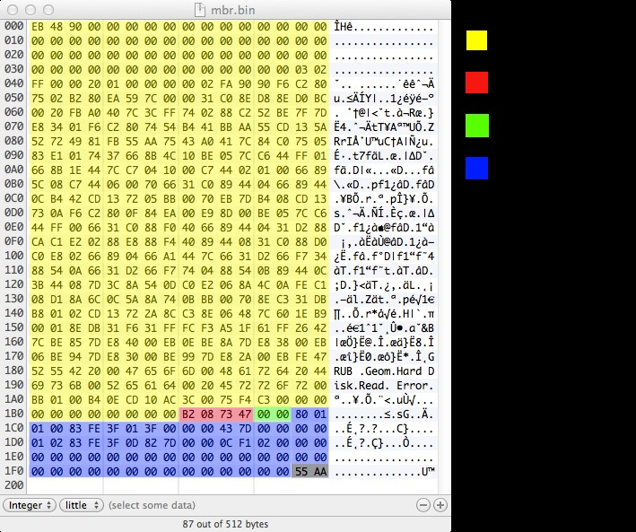
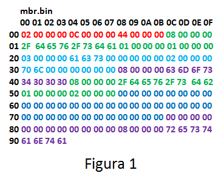
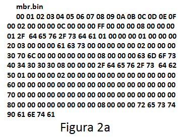
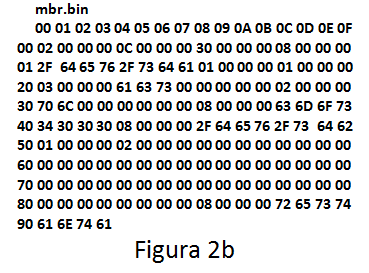
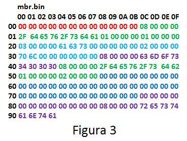

# Master Boot Record

## Enunțul temei
* Primul sector fizic de pe un hard-disk poartă numele de Master Boot Record (MBR). Acest sector are 512 octeți și conține informații foarte importante despre modul cum este partiționat hard-disk-ul. Dacă acest sector este suprascris sau șters toate informațiile de pe hard-disk se șterg.

* În cadrul MBR se găsesc informații despre fiecare partiție de pe hard-disk. Aceste informații sunt stocate într-o tabelă de partiții primare care are doar patru intrări. Prin urmare MBR-ul poate reține informații doar pentru 4 partiții primare. Una dintre aceste patru partiții primare va fi marcată ca activă și de pe ea se va încerca pornirea sistemului de operare. MBR-ul mai contine și bootloader-ul – un mic program care pornește un sistem de operare prezent pe computer. În figura următoare se poate vedea configurația unui MBR:
 


## Implementare
* În implementarea temei vom considera un model simplificat al MBR, întrucat unele informații nu sunt relevante pentru noi în acest moment. Vom simula un sistem de fișiere de pe un hard-disk, considerat un fișier binar din motive de simplitate. Partițiile existente sunt toate primare, iar numărul lor poate fi mai mare decât patru.

* Definim următoarele elemente:
  * MBR (Master Boot Record)
    * Păstrează funcționalitatea unui MBR real, dar va fi particularizat pentru această temă. El va conține doar următoarele informații:
      * un int reprezentând numărul de partiții existente.
      * o listă cu adresele de început pentru fiecare partiție existentă. În continuare ne vom referi la o adresă ca fiind o poziție din fișierul binar pe care se lucrează. Prima poziție din fișier este 0x00.
  * Partiție
    * O partiție înglobează un sistem de fișiere și directoare, având o dimensiune specificată.
    * Conține în ordine următoarele informații:
      * header = o succesiune de 20 bytes cu următoarea semnificație:
        * un int reprezentând lungimea numelui partiției.
        * 8 bytes reprezentând numele partiției; prin convenție, numele partiției este de forma “/dev/sd?”, unde ? este un character alfanumeric.
        * un int reprezentând numărul maxim de directoare de pe partiție. Notăm acest număr cu MAXD.
        * un int reprezentând numărul maxim de fișiere de pe partiție. Notăm acest număr cu MAXF.
      * exact MAXD directoare, fiecare având exact MAXF fișiere alocate (după regulile care vor fi prezentate în continuare).
      * MAXF fișiere specifice partiției.
  * Director
    * Conține în ordine următoarele informații:
      * header = o succesiune de 12 bytes cu următoarea semnificație:
        * un int reprezentând lungimea numelui directorului.
        * 8 bytes reprezentând numele directorului.
      * MAXF fișiere aparținând directorului curent. MAXF este cel specificat în header-ul partiției curente.
  * Fișier
    * Conține doar un header definit ca o succesiune de 12 bytes cu următoarea semnificație: un int reprezentând lungimea numelui fișierului și 8 bytes reprezentând numele fișierului.
    
### Observatii
* Header-ul se regăsește în componența fiecărui element. Pentru simplitate se consideră că header-ul începe cu 12 bytes, din care 4 bytes reprezintă lungimea numelui. Următorii 8 bytes sunt rezervați numelui. Dacă valoarea primului int este mai mică decât 8, atunci se rezervă tot 8 bytes, completându-se cu zerouri (spre dreapta).
* Un director inexistent este reprezentat pe hard-disk ca un director existent, având toată informația setată pe 0.
* Un fișier inexistent este reprezentat pe hard-disk ca un fișier existent, având toată informația setată pe 0.

Pentru a ilustra cele spuse anterior vom considera exemplul din Figura 1:



* In figură am folosit următoarele convenții:
  * MBR = roșu.
  * Descrierea unei partiții = verde.
  * Descrierea unui director = albastru.
  * Descrierea unui fișier = mov.
  * Indexul de start al liniilor, respectiv indicii coloanelor = negru (acesta este doar pentru exemple, fișierele de intrare nu vor conține aceste valori).

În exemplu, MBR conține două partiții: prima începe la poziția 0x0C în fișier, iar cea de-a doua partiție începe la poziția 0x44 (0x semnifică baza 16; 44 în baza 16 înseamnă 68 în baza 10).

* Prima partiție are numele “/dev/sda”, MAXD = 1, MAXF = 1 și conține:
  * directorul “/dev/sda/acs”
  * fișierele “/dev/sda/acs/pl”, “/dev/sda/cmos4000”
  
Analog se definește și a doua partiție.

## Cerințe
### Task 1 - Validare MBR
* Dându-se un fișier de intrare cu o astfel de configurație se cere să se verifice corectitudinea valorilor din MBR. Un MBR este valid dacă adresele partițiilor menționate sunt corecte în cadrul fișierului. Dacă configurația este validă, atunci se vor afișa la stdout:
  * pe prima linie mesajul “SUCCES”
  * pe următoarele linii tabela de partiții. Fiecare linie are urmatorul format:
    * “nume_partitie total_space used_space”. Valorile numerice afișate se exprima în bytes.
    * total_space reprezintă numărul de bytes alocați pe partiție pentru fișiere și directoare (acest număr nu se modifică pentru o partiție dată).
    * used_space reprezintă numărul de bytes alocați pentru directoarele și fișierele existente.
* În cazul în care nu este validă configurația se va afișa doar mesajul “INVALID”.

#### Exemple
* Pentru exemplul din Figura 1 se va afișa următorul output:

``` text
SUCCES
/dev/sda 36 36
/dev/sdb 60 12
```

#### Explicatie
* Prima parție are un total_space (egal cu occupied_space) de 36 bytes deoarece conține:
  * un fișier (care ocupă 12 bytes).
  * un director cu un fișier în el (care ocupă 12+12 bytes). 
* A doua partiție contine doar un fișier, deci occupied_size este 12 bytes.
* Partiția mai are alocat spațiu pentru încă un fișier inexistent (12 bytes), precum și pentru un director cu 2 fișiere în el (12 + 2*12 = 36 bytes).




* Exemple de fișiere invalide se regăsesc în Figura 2. 

### Task 2 - Operații cu sistemul de fișiere
* Se va da un set de operații care trebuie să fie aplicat asupra sistemului de fișiere. Se cere implementarea următoarelor operații:
  * CREATE_FILE [path]
    * Se va crea fișierul specificat prin calea absolută [path].
    * Întrucât un director are alocat un număr fix de sloturi pentru fișiere, unele fiind goale (pline de 0), se va folosi primul slot liber din directorul respectiv pentru a aloca noul fișier.
  * RENAME_FILE [path] [newName]
    * Se va redenumi fișierul specificat prin calea absolută [path]. 
  * DELETE_FILE [path]
    *  Se va șterge fișierul specificat prin calea absolută [path].
  * CREATE_DIR [path]
    * Se va crea directorul specificat prin calea absolută [path].
    * Întrucât o partiție are alocat un număr fix de sloturi pentru directoare, unele fiind goale (pline de 0), se va folosi primul slot liber din partiția respectivă pentru a aloca noul director.
  * RENAME_DIR [path] [newName]
    * Se va redenumi directorul specificat prin calea absolută [path].
  * DELETE_DIR [path]
    * Se va șterge directorul specificat prin calea absolută [path].
  * PRINT [path]
    * Se va afișa lista de fișiere conținute in directorul de la calea absolută [path]. Se va afișa câte un element pe linie. În caz de succes această operație nu va mai afișa mesajul “SUCCES”, ci doar lista de fișiere.
* O operație executată cu succes va afișa la stdout mesajul “SUCCES”, iar o operație care nu se poate executa va afișa mesajul “INVALID”. 

### Task 3 - Operații cu partiții
* Într-un sistem real partițiile sunt dinamice, în sensul că pot suferi modificări. Pentru a simula aceste functionalități se cere implementarea următoarelor operații:
  * DELETE_PARTITION [name]
    * Se va șterge partiția dată prin nume. Atenție! Ștergerea presupune doar eliminarea partitiei din MBR.
  * CREATE_PARTITION [name] [MAXD] [MAXF]
    * Se parcurge hard-disk-ul în cautarea unei porțiuni de memorie continua liberă și suficient de mare pentru alocarea unui partiții.
    * Dacă operația reușeșeste (se creează partiția cu caracteristicile date), atunci aceasta va afișa doar adresa de început a partiției create.
  * FORMAT_PARTITION [name]
    * Se initializează cu 0 toată zona de memorie corespunzătoare directoarelor și fișierelor de pe partiție.
* O operație executată cu succes va afișa la stdout mesajul “SUCCES”, iar o operație care nu se poate executa va afișa mesajul “INVALID”. 

### Task 4 - bonus - Restore MBR
* Există situații în care valorile din MBR pot fi alterate.
* Dorim să refacem MBR cu toate parțiile valide.
* Se cunoaște doar lista de partiții (numele lor) și configurația hardk-disk-ului, se cere afișarea MBR-ului corect.
* Un exemplu se regăsește în Figura 3.



* Output-ul corespunzător este următorul:

``` text
MBR_SIZE: 2
PARTITIONS_OFFSET: 12 68
```

